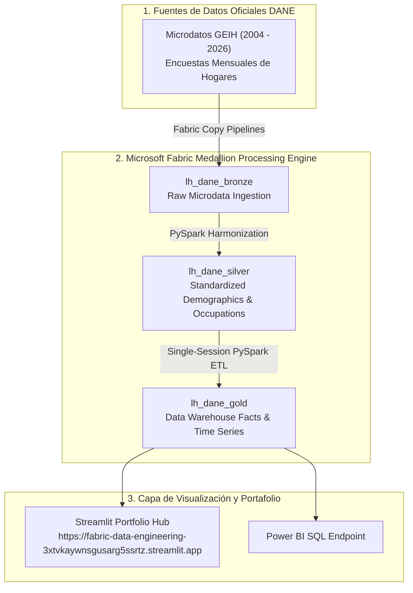

# 🇨🇴 DANE Colombia: Mercado Laboral & Empleo (2004 - 2026)
### Enterprise Data Platform for Longitudinal Labor Market Microdata on Microsoft Fabric

---

## 📋 Resumen del Proyecto

Este proyecto procesa y consolida más de **22 años de microdatos oficiales de empleo y mercado laboral en Colombia (2004 a 2026)** provenientes de la **Gran Encuesta Integrada de Hogares (GEIH)** del **DANE** (Departamento Administrativo Nacional de Estadística).

Aplica la **Arquitectura Medallón (Bronze ➔ Silver ➔ Gold)** sobre **Microsoft Fabric & Delta Lake**, permitiendo realizar análisis socioeconómicos de alta velocidad sobre ocupación, desempleo, tasa global de participación (TGP) e informalidad laboral en las principales áreas metropolitanas del país.

---

## 🏛️ Arquitectura del Sistema

---

## 📊 Medallion Architecture Highlights

1. **🟤 Capa Bronze (`lh_dane_bronze`)**:
   - Ingestión cruda de los microdatos mensuales de la GEIH (archivos comprimidos Parquet / CSV).
   - Preservación de esquemas de codificación de municipios, ramas CIIU y características demográficas.

2. **⚪ Capa Silver (`lh_dane_silver`)**:
   - Armonización de cambios metodológicos en las encuestas entre 2004 y 2026.
   - Cálculo de ponderadores factoriales de expansión poblacional.
   - Limpieza y filtrado de ocupados, desocupados e inactivos.

3. **🟡 Capa Gold (`lh_dane_gold`)**:
   - Modelo en estrella para series de tiempo:
     - `fact_ocupacion_mensual`: Hechos consolidados por mes y división político-administrativa.
     - `fact_desempleo_ciudad`: Desglose por las 7 principales áreas metropolitanas (Bogotá, Medellín, Cali, Barranquilla, Bucaramanga, Manizales, Pereira).
     - `dim_geografia_metropolitana`: Catálogo de divisiones territoriales.
     - `kpi_series_historicas_2004_2026`: Series consolidadas de 22 años para análisis de tendencias sociodemográficas.

---

## 🚀 Integración en el Hub de Portafolio

Este proyecto está integrado en el **Multi-Project Data Engineering Portfolio Hub**:
- 🌐 **URL de Producción**: [https://fabric-data-engineering-3xtvkaywnsgusarg5ssrtz.streamlit.app](https://fabric-data-engineering-3xtvkaywnsgusarg5ssrtz.streamlit.app)
