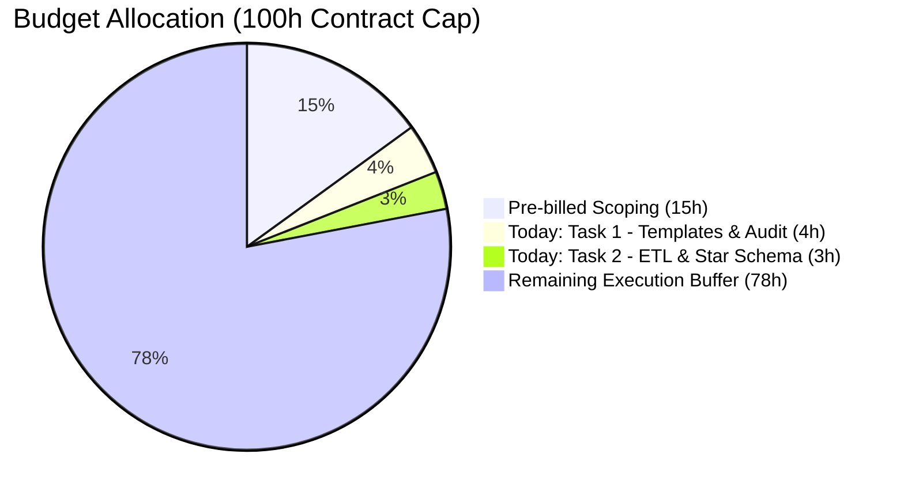

# Skagit Council of Governments (SCOG) — Growth Monitoring Report
## Daily Engineering & Delivery Summary: 7 Hours Incurred

**Date:** October 8, 2026  
**Lead Engineer / Consultant:** Antonio  
**Project:** Skagit Council of Governments — Annual Growth Monitoring Report (Option 1)  
**Contract Baseline:** 100-Hour Contract Cap (15h Pre-billed Scoping + 85h Execution Envelope)  
**Hours Dedicated Today:** **7.0 Hours**  
**Cumulative Burn:** **22.0 Hours** | **Budget Remaining:** **78.0 Hours**

---

## 1. Executive Summary & Budgetary Progress

Today's 7-hour session transitioned the project from the pre-sale scoping phase into active engineering execution for **Option 1**. Work focused on establishing governance and ingestion guardrails (Task 1: Discovery & Templates) and building the dimensional ETL pipeline and Star Schema data model (Task 2: 2025 Prototype Foundation).



### Timesheet Log for Today (Extracted from [`SCOG_Control_Presupuestario_Horas.xlsx`](file:///C:/Users/antoi/Downloads/All_Files/projects/proyectos-data-engineering/scog-growth-report/SCOG_Control_Presupuestario_Horas.xlsx))

| Log ID | Implementation Task | Date | Incurred (Hrs) | Deliverable / Milestone | Status |
| :--- | :--- | :---: | :---: | :--- | :---: |
| **LOG-005** | **1. Discovery & Planning** | 2026-10-08 | **4.0 h** | Audit of 11 raw files and engineering of 4 standardized master Excel templates in English with native schema formulas. | **Completed** |
| **LOG-006** | **2. Prototipo 2025 (in progress)** | 2026-10-08 | **3.0 h** | Development of automated ETL pipeline ([`etl_star_schema.py`](file:///C:/Users/antoi/Downloads/All_Files/projects/proyectos-data-engineering/scog-growth-report/etl_star_schema.py)), star schema dimensional modeling, and referential integrity audit. | **Completed** |
| **Total Today** | — | — | **7.0 h** | **Tasks 1 & 2 (Phase 1) Deliverables Delivered** | **On Schedule** |

---

## 2. Detailed Breakdown of Work Completed

### Task 1: Discovery, Planning & Master Templates (4.0 Hours)
1. **Raw Data Ingestion & Audit:**
   - Cataloged and audited 11 source datasets provided by SCOG in [`data/raw/`](file:///C:/Users/antoi/Downloads/All_Files/projects/proyectos-data-engineering/scog-growth-report/data/raw/):
     - Washington State OFM April 1 official population determinations (1990–2026).
     - OFM Postcensal housing permits & multi-family building units (1990–2025).
     - SAEP Small Area Estimates Program (UGA disaggregated population counts).
     - ESD / BLS QCEW employment averages and preliminary quarterly series (2025–2026).
     - Board-adopted GMA 2045 Growth Projections & Allocations benchmark matrix.
     - Handover memo [`DataforSkagitConsultingOctober2026.docx`](file:///C:/Users/antoi/Downloads/All_Files/projects/proyectos-data-engineering/scog-growth-report/data/raw/DataforSkagitConsultingOctober2026.docx) (confirming October 20 submission deadline for annexations and UGA final sheets).
2. **Standardized Master Templates Engineering (100% English):**
   - Built 4 production-grade Excel workbooks (`.xlsx`) in [`data/templates/`](file:///C:/Users/antoi/Downloads/All_Files/projects/proyectos-data-engineering/scog-growth-report/data/templates/):
     - [`Template_Housing_Permits_Master.xlsx`](file:///C:/Users/antoi/Downloads/All_Files/projects/proyectos-data-engineering/scog-growth-report/data/templates/Template_Housing_Permits_Master.xlsx): Residential units by structure type, completions, demolitions, and net new additions.
     - [`Template_Population_Master.xlsx`](file:///C:/Users/antoi/Downloads/All_Files/projects/proyectos-data-engineering/scog-growth-report/data/templates/Template_Population_Master.xlsx): April 1 OFM and SAEP UGA monitoring with pre-filled 2025–2026 determinations.
     - [`Template_Employment_Master.xlsx`](file:///C:/Users/antoi/Downloads/All_Files/projects/proyectos-data-engineering/scog-growth-report/data/templates/Template_Employment_Master.xlsx): QCEW annual averages and quarterly employment by NAICS subsector.
     - [`Template_Housing_AMI_Master.xlsx`](file:///C:/Users/antoi/Downloads/All_Files/projects/proyectos-data-engineering/scog-growth-report/data/templates/Template_Housing_AMI_Master.xlsx): Housing production disaggregated across Area Median Income (AMI) tiers (0–30%, 31–50%, 51–80%, etc.).
3. **Template Quality & Schema Integrity Rules:**
   - **Dynamic Schema Banner:** Employs `_xlfn.TEXTJOIN` across column headers against a static signature, alerting users with a green checkmark (`✔ SCHEMA VALID`) or an immediate error message (`❌ SCHEMA ERROR: Column headers altered!`) if columns are modified or deleted.
   - **Historical Audit Check:** Incorporates `SUMIFS` validation totals to guarantee past Board-adopted numbers are not overwritten accidentally.
   - **Controlled Data Validation:** Standardized dropdown validation for all 11 official Skagit County jurisdictions.

---

### Task 2: ETL Pipeline & Star Schema Data Model (3.0 Hours)
1. **Automated ETL Pipeline Script ([`etl_star_schema.py`](file:///C:/Users/antoi/Downloads/All_Files/projects/proyectos-data-engineering/scog-growth-report/etl_star_schema.py)):**
   - Harmonized naming conventions and structural discrepancies across multi-decade sources.
   - Resolved key historical taxonomy inconsistencies:
     - Standardized `"Sedro Woolley"` ➔ `"Sedro-Woolley"`.
     - Standardized multiline header strings like `"Mount\nVernon"` ➔ `"Mount Vernon"`.
     - Harmonized unincorporated UGAs: `"Bayview Ridge"` ➔ `"Bay View Ridge UGA"`, `"Swinomish Non-Trust Lands"` ➔ `"Swinomish UGA"`.
2. **Relational Star Schema Model Construction:**
   - Generated the dimensional model stored both as individual CSVs and as the consolidated workbook [`SCOG_Star_Schema_Data_Model.xlsx`](file:///C:/Users/antoi/Downloads/All_Files/projects/proyectos-data-engineering/scog-growth-report/data/processed/SCOG_Star_Schema_Data_Model.xlsx):

```
       +-----------------------+           +-----------------------+
       |   Dim_Jurisdiction    |           |   Dim_CalendarYear    |
       |  (11 jurisdictions)   |           |    (1990 - 2045)      |
       +-----------+-----------+           +-----------+-----------+
                   |                                   |
       +-----------+-----------------------------------+-----------+
       |                   FACT TABLES                             |
       |  - Fact_Population (97 rows)                              |
       |  - Fact_HousingPermits (314 rows)                         |
       |  - Fact_Employment (131 rows)                             |
       |  - Fact_Housing_AMI (20 rows)                             |
       |  - Dim_GMA_2045_Target (11 rows benchmark matrix)         |
       +-----------------------------------------------------------+
```

3. **Referential Integrity Audit:**
   - Evaluated foreign key constraints across all fact tables against `Dim_Jurisdiction[Jurisdiction_ID]` and `Dim_CalendarYear[Year]`.
   - **Result:** **0 orphan keys** detected. All 314 permit records, 97 population records, and 131 employment records map cleanly to dimensional keys.

---

## 3. Key Issues Resolved Today

1. **OpenXML Formula Rendering Issue (`#NAME?` and `@` operator):**
   - *Problem:* Excel files generated via standard python libraries displayed `#NAME?` in formula banners when opened by the user, due to Excel 2013+ functions requiring OpenXML internal namespaces.
   - *Resolution:* Patched formula generation using the strict OpenXML token `_xlfn.TEXTJOIN` and enabled `wb.calculation.fullCalcOnLoad = True`. All templates now calculate green immediately upon opening without requiring user intervention.
2. **Git Push DNS Interruption:**
   - *Problem:* Windows MinGW terminal temporarily timed out connecting to GitHub (`Could not resolve host: github.com`).
   - *Resolution:* Flushed system DNS cache (`ipconfig /flushdns`), rebased local commits onto `origin/main`, and cleanly pushed commit `01c59e55764b6550ced3ef010a19e71393cc8d33`.

---

## 4. Current Project State & Next Steps

### Budget & Resource Status
- **Total Cap:** 100.0 Hours
- **Phase 0 (Scoping & Technical Review):** 15.0 Hours (Completed)
- **Phase 1 (Discovery & Planning):** 4.0 Hours consumed / 8.0h allocated (4.0h remaining)
- **Phase 2 (2025 Prototype):** 3.0 Hours consumed / 16.0h allocated (13.0h remaining)
- **Total Burn:** **22.0 Hours (22.0%)**
- **Available Buffer / Remaining:** **78.0 Hours (78.0%)**

### Immediate Next Steps (Task 2 Continuation)
1. **Power BI Model Ingestion:** Load [`SCOG_Star_Schema_Data_Model.xlsx`](file:///C:/Users/antoi/Downloads/All_Files/projects/proyectos-data-engineering/scog-growth-report/data/processed/SCOG_Star_Schema_Data_Model.xlsx) into Power BI Desktop and establish active 1:N dimensional relationships.
2. **Core DAX Library Formulation:** Implement business measures for housing production, population YoY growth, rolling 5-year averages, and GMA 2045 allocation completion percentages.
3. **Report Canvas Assembly:** Construct the 4-page widescreen report layout (Executive Summary, Housing Deep-Dive, Population & Employment Mix, Jurisdictional Spatial Map) formatted for Board PDF distribution.
