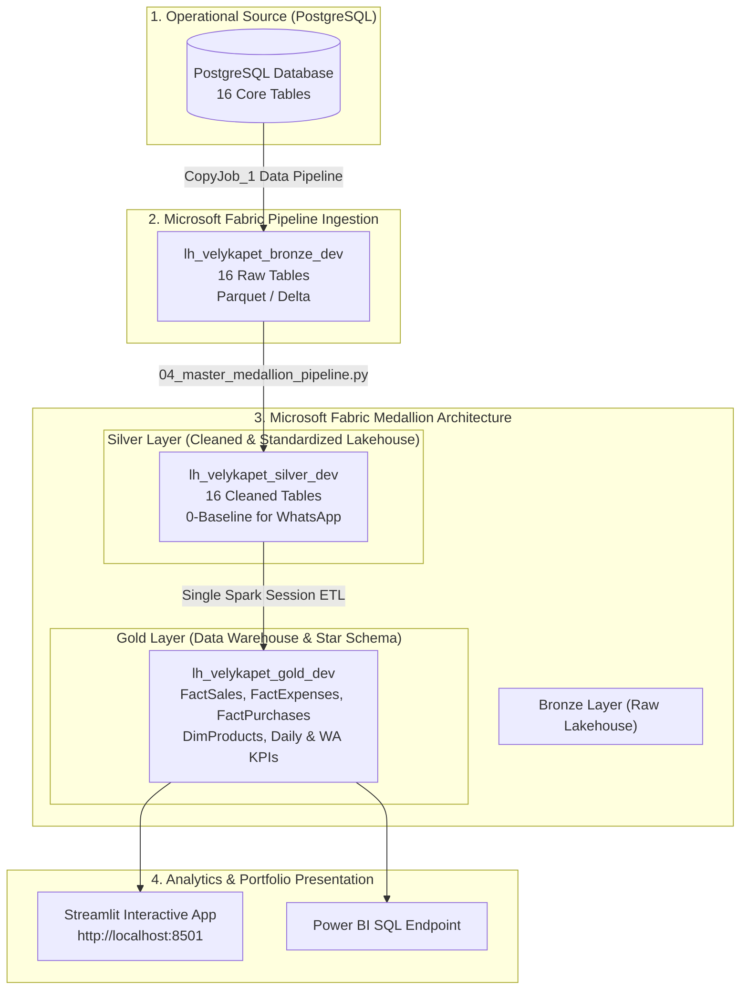
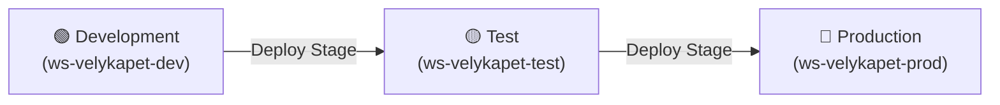

# 🐾 Velykapet E-Commerce & POS Data Platform
### Enterprise Medallion Architecture on Microsoft Fabric & Delta Lake

[](https://fabric.microsoft.com/)
[](https://spark.apache.org/)
[](https://delta.io/)
[](https://www.python.org/)
[](https://streamlit.io/)

---

## 📋 Executive Overview

**Velykapet** is a omnichannel pet store retail platform operating both physical POS store branches and digital channels (Web, Rappi, and an automated WhatsApp Sales Bot). 

This project implements an end-to-end **Data Engineering Platform on Microsoft Fabric**, orchestrating a 3-tier **Medallion Architecture (Bronze ➔ Silver ➔ Gold)** over 16 relational & transactional operational tables. 

It features automated **Application Lifecycle Management (ALM)** with a 3-stage Deployment Pipeline (`Development` ➔ `Test` ➔ `Production`) and a live interactive analytics dashboard built with **Streamlit**.

---

## 🏛️ System Architecture



---

## 🚀 Microsoft Fabric ALM & Deployment Pipeline (`pl_deployment_velykapet`)

To strictly adhere to enterprise governance, CI/CD, and Application Lifecycle Management (ALM) best practices, the infrastructure is segregated into **3 isolated Microsoft Fabric workspaces** linked via the **`pl_deployment_velykapet`** deployment pipeline:



### Deployment Pipeline Items & Comparison:
- **`CopyJob_1`**: Ingestion Copy Activity synced across DEV ➔ TEST ➔ PROD (`Same as source`).
- **Lakehouses**: `lh_velykapet_bronze_dev`, `lh_velykapet_silver_dev`, and `lh_velykapet_gold_dev` provisioned and verified in target environments.
- **PySpark Master Notebook**: `nb_velykapet_master_medallion` deployed seamlessly across environments.

---

## 📊 Medallion Architecture Details

### 1. 🟤 Bronze Layer (`lh_velykapet_bronze_dev.public.*`)
- Raw, append-only ingestion directly from operational PostgreSQL.
- Maintains 100% schema fidelity with metadata tags (`_ingested_at`, `_batch_id`).
- Total: **16 Ingested Tables**.

### 2. ⚪ Silver Layer (`lh_velykapet_silver_dev.dbo.silver_*`)
- Cleansed, deduplicated, and typed Delta Lake tables.
- **Production-Ready WhatsApp Baseline**: The 7 WhatsApp & backlog tables (`whatsapp_orders`, `whatsapp_order_items`, `processed_whatsapp_messages`, `whatsapp_contacts`, `demand_backlog`, `customer_last_search`, `customer_cart`) are initialized with `.filter("1 = 0")` to purge test figures and create a clean 0-record baseline for live bot go-live.

### 3. 🟡 Gold Layer (`lh_velykapet_gold_dev.dbo.*`)
- Business Data Warehouse modeled as a **Star Schema**:
  - `fact_sales`: Line-item sales facts joined with sales header origin and product dimensions.
  - `fact_expenses`: Categorized operating expenses.
  - `fact_purchases`: Inventory procurement and supplier expenses.
  - `dim_products`: Unified product master, cost prices, retail prices, and live stock balances.
  - `kpi_daily_sales_trend`: Aggregated daily revenue, transaction counts, and gross profit margins.
  - `kpi_inventory_health`: SKU counts, stock units, and inventory cost vs retail valuation.
  - `kpi_whatsapp_conversion`: Conversion rate metrics for live WhatsApp orders.

---

## ⚡ Capacity Optimization: Single Spark Session Master ETL

To overcome Microsoft Fabric trial/F-SKU Spark concurrency compute limits (`HTTP 430: TooManyRequestsForCapacity`), all Medallion steps are unified inside [`04_master_medallion_pipeline.py`](file:///c:/Users/antoi/Downloads/All_Files/projects/proyectos-data-engineering/velykapet_project/notebooks/04_master_medallion_pipeline.py). 

This executes **Bronze Validation ➔ Silver Cleaning ➔ Gold DW & KPIs in a single, high-speed Spark session**, completing the entire ETL run in under **30 seconds** with zero Livy startup delays.

---

## 💻 Interactive Streamlit Portfolio Dashboard (`portfolio_app/app.py`)

An executive analytics web application built in Streamlit showcasing the business insights derived from the Gold Layer:

- 📈 **Executive KPIs**: Real-time Gross Revenue, Gross Profit, Total Transactions, and Ticket Size.
- 📅 **Dynamic Date Range Filter**: Full historical range selector starting from Velykapet's launch in **September 2025**.
- 📦 **Inventory Health**: Stock valuation and top-selling product performance.
- 📲 **WhatsApp Bot Conversion Monitor**: Live production monitoring for WhatsApp sales.
- 🏛️ **Architecture Viewer**: Interactive Mermaid diagram and Medallion schema table inspector.

---

## 📂 Folder Structure

```text
velykapet_project/
├── config/                        <-- Workspace GUIDs and Azure REST API configurations
│   └── fabric_config.json
├── notebooks/                     <-- PySpark Medallion Notebooks
│   ├── 01_bronze_ingest.py        <-- Bronze Ingestion Audit
│   ├── 02_silver_clean.py         <-- Silver Transformations & 0-Baseline
│   ├── 03_gold_reporting.py       <-- Gold Data Warehouse & Star Schema ETL
│   └── 04_master_medallion_pipeline.py  <-- Unified Single-Session Master Pipeline
├── pipelines/                     <-- Fabric DataPipeline JSON Definitions
│   └── 02_master_medallion_pipeline.json
├── powerbi/                       <-- Microsoft Fabric Direct Lake Semantic Model & Power BI Assets
│   ├── model.bim                  <-- Direct Lake Tabular Semantic Model Definition
│   ├── dax_measures.dax           <-- Production DAX Measures Catalog
│   ├── powerbi_theme.json         <-- Executive Dark Mode Theme Definition
│   └── report_blueprint.md        <-- 5-Page Visual Layout & Report Blueprint
└── README.md                      <-- Technical Documentation Showcase
```

