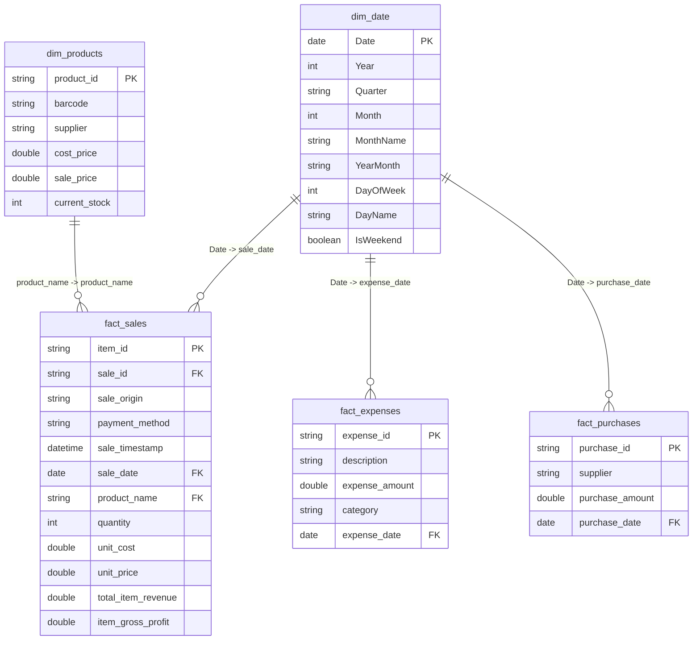

# 📊 Velykapet Omnichannel Power BI Report Specification
### Microsoft Fabric Direct Lake Semantic Model & Visual Layout Blueprint

---

## 🏛️ Semantic Model Architecture (`sm_velykapet_gold_analytics`)

---

## 📑 Report Structure & Visual Layouts

### Page 1: 🌟 Executive Financial Overview (`Resumen Ejecutivo`)
- **Top KPI Cards Row**:
  - `[Total Revenue]` (formatted as currency `$#,##0.00`, with MoM % indicator)
  - `[Gross Profit]` & `[Gross Margin %]`
  - `[Net Operating Profit]` & `[Net Profit Margin %]`
  - `[Total Transactions]` & `[Average Order Value (AOV)]`
- **Visuals Grid**:
  - **Left (Line & Clustered Column Chart)**: `Revenue & Gross Profit Trend by Month/Day` (X: `dim_date[Date]`, Y1: `[Total Revenue]`, Y2: `[Gross Margin %]`).
  - **Right Top (Donut Chart)**: `Revenue Breakdown by Origin / Channel` (Legend: `fact_sales[sale_origin]`, Values: `[Total Revenue]`).
  - **Right Bottom (Bar Chart)**: `Top 10 Products by Revenue & Margin` (Y: `dim_products[product_name]`, X: `[Total Revenue]`, Tooltip: `[Gross Margin %]`).

---

### Page 2: 🛍️ Omnichannel Sales Performance (`Ventas Multicanal`)
- **Slicers**: Date Range Slider (`dim_date[Date]`), Channel Multi-select (`fact_sales[sale_origin]`), Payment Method (`fact_sales[payment_method]`).
- **Visuals Grid**:
  - **Matrix**: Channel Performance (`sale_origin` vs `Transactions`, `Revenue`, `AOV`, `Average Units Per Order`, `Margin %`).
  - **Heatmap / Stacked Bar**: Hourly & Daily Peak Distribution (X: `DayOfWeek`, Y: `Hour`, Value: `[Total Transactions]`).
  - **Treemap**: Payment Method Distribution across Store vs Digital.

---

### Page 3: 💸 Financial Control & Procurement (`Gastos & Proveedores`)
- **Top KPI Cards Row**:
  - `[Total Expenses]` (Operating OpEx)
  - `[Total Purchases]` (Procurement CapEx/COGS)
  - `[Expense to Revenue Ratio %]`
- **Visuals Grid**:
  - **Waterfall Chart**: Revenue $\rightarrow$ Cost of Goods Sold $\rightarrow$ Gross Profit $\rightarrow$ Operating Expenses $\rightarrow$ Net Operating Profit.
  - **Donut Chart**: OpEx by Category (`fact_expenses[category]`).
  - **Table**: Supplier Procurement Summary (`fact_purchases[supplier]`, `[Total Purchases]`, `Transaction Count`).

---

### Page 4: 📦 Inventory Health & Stock Control (`Inventario & Stock`)
- **Top KPI Cards Row**:
  - `[Total Active SKUs]`
  - `[Current Stock Units]`
  - `[Inventory Cost Valuation]` vs `[Inventory Retail Valuation]`
  - `[Stock-Out Alert SKUs]` (SKUs with stock $\le$ 5)
- **Visuals Grid**:
  - **Critical Stock Alert Table**: Filtered on `dim_products[current_stock] <= 5` with Barcode, Product Name, Cost, Price, Current Stock, and Supplier.
  - **Scatter Plot**: Stock Quantity vs Unit Profit Margin (Bubble size: `[Potential Inventory Margin]`).

---

### Page 5: 🤖 WhatsApp Bot & Digital Conversion (`Bot WhatsApp & Embudo Digital`)
- **Funnel Visual**:
  - Stage 1: Incoming WhatsApp Inquiries / Chats
  - Stage 2: Product Consultations & Price Checks
  - Stage 3: Cart Additions
  - Stage 4: Completed Orders (`fact_sales[sale_origin] = 'WhatsApp'`)
- **KPI Metrics**:
  - `[WhatsApp Bot Revenue]`
  - `[WhatsApp Revenue Share %]`
  - Order Conversion Rate %

---

## 🚀 How to Connect Power BI to Microsoft Fabric Direct Lake

1. In **Microsoft Fabric**, navigate to workspace `ws-velykapet-dev` (or `ws-velykapet-prod`).
2. Open **`lh_velykapet_gold_dev`** Lakehouse.
3. Click **"New Semantic Model"** in the top ribbon.
4. Select the Gold tables:
   - `fact_sales`
   - `fact_expenses`
   - `fact_purchases`
   - `dim_products`
5. Name the model: **`sm_velykapet_gold_analytics`**.
6. Create the DAX measures from [`dax_measures.dax`](file:///c:/Users/antoi/Downloads/All_Files/projects/proyectos-data-engineering/velykapet_project/powerbi/dax_measures.dax).
7. Apply the theme file [`powerbi_theme.json`](file:///c:/Users/antoi/Downloads/All_Files/projects/proyectos-data-engineering/velykapet_project/powerbi/powerbi_theme.json).
8. Assemble the visual pages following the blueprint above or open the Power BI Desktop project.
